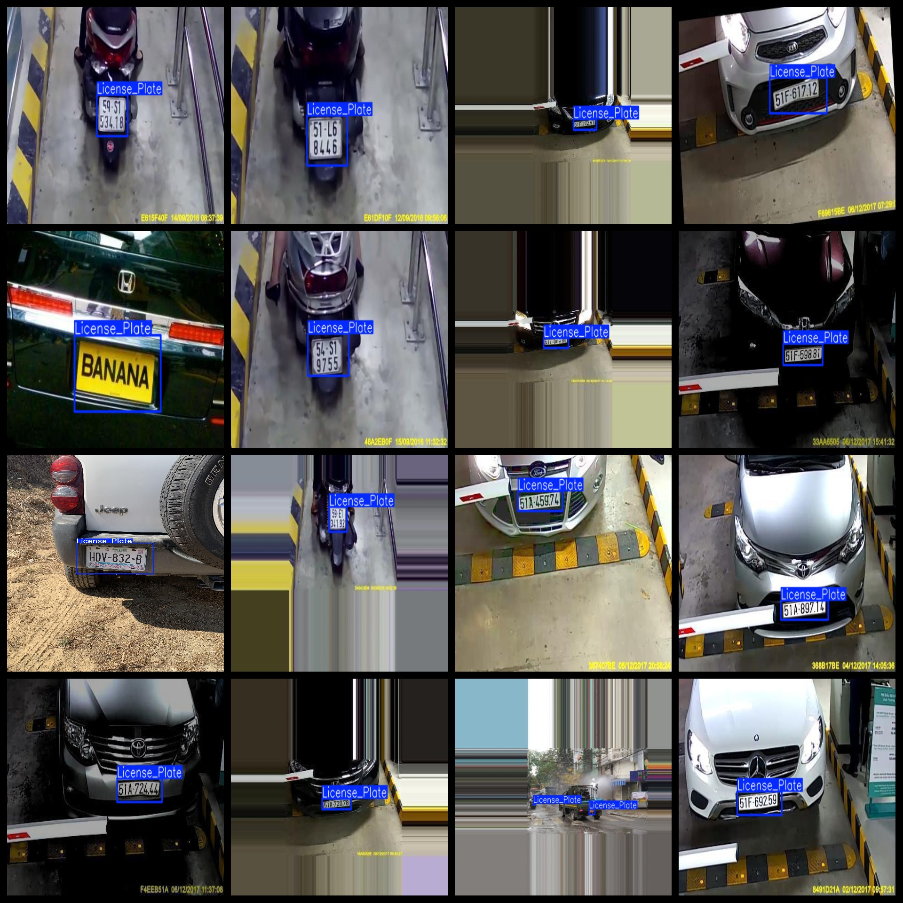
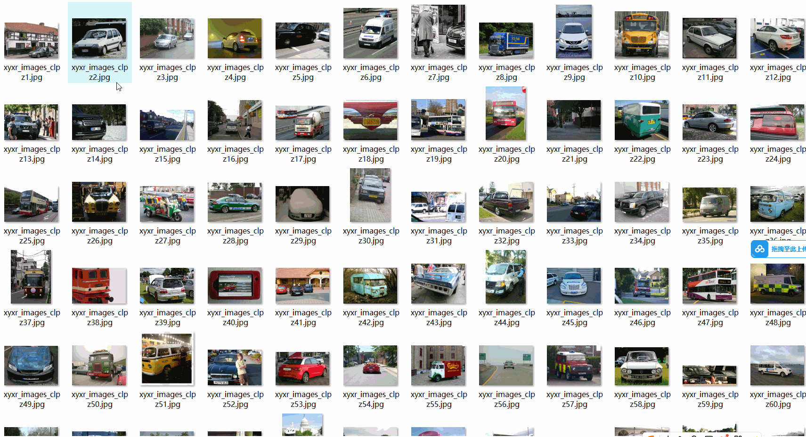

# [Object Detection] Vehicle License Plate Dataset

10116 images in YOLO+VOC format

Dataset format: VOC format + YOLO format

Compressed with three folders, each storing images, xml, and txt files

In the JPEGImages folder, there are a total of 10116 jpg images

In the Annotations folder, there are a total of 10116 xml files

In the labels folder, there are a total of 10116 txt files

Number of label categories: 1

Label name: "License_Plate"

Number of bounding boxes (note that the order of categories in the YOLO format does not match this, but is based on the classes.txt in the labels folder):

License_Plate bounding boxes = 10637

Total number of bounding boxes: 10637

Image clarity (resolution: pixels): Clear

Image enhancement: No

Label shape: Rectangular box, used for target detection recognition

Important note: License plates refer to the license plates of vehicles, motorcycles, and other similar items; not all are necessarily on the vehicle body

Special declaration: This dataset does not guarantee the accuracy or weight files of trained models, only provides accurate and reasonable annotation.

## Images

---

Here is a pay link on Stripe (https://buy.stripe.com/3cs8yP7sY87d0vu9AB). Please contact me lonlonago@foxmail.com after funding $89, and I will send you a complete data files, thank you!

